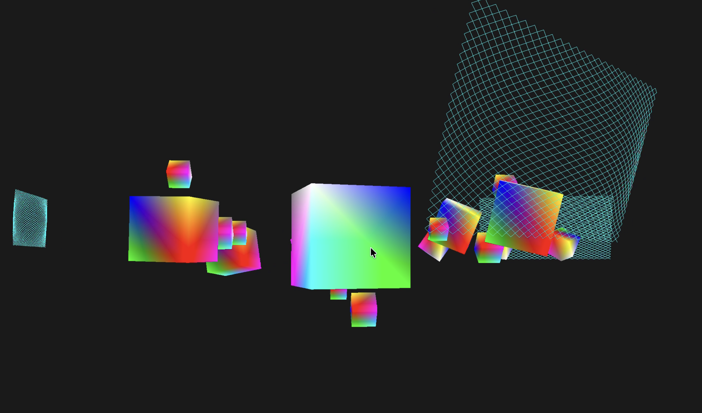

# Assignment 2: 3D Kinetic Sculpture Animation

## Overview

This project implements a dynamic 3D kinetic sculpture animation using OpenGL and modern graphics programming techniques. The sculpture features multiple animated cubes with different movement patterns including rotation, pendulum motion, and orbital mechanics, creating a mesmerizing visual experience.

## Features

### 🎨 Advanced Kinetic Sculpture Elements
- **Central Rotating Element**: A main cube that rotates continuously with complex axis movement
- **Pendulum System**: Four synchronized pendulum elements that swing with realistic physics
- **Orbital Mechanics**: Six elements orbiting with dynamic radius variation and vertical oscillation
- **Floating Elements**: Eight small cubes that float in complex 3D patterns
- **Parametric Pattern Decorations**: Three animated geometric patterns that orbit around the sculpture
- **Wind Simulation**: Dynamic wind effects that influence all elements
- **Realistic Lighting**: Phong shading with ambient, diffuse, and specular lighting

### 🎮 Interactive Controls
- **Mouse Look**: Move mouse to look around the scene
- **WASD Movement**: Use W/A/S/D keys to move the camera
- **Scroll Zoom**: Mouse wheel to zoom in/out
- **ESC**: Exit the application

### ⚙️ Technical Features
- Real-time 3D rendering using OpenGL 3.3 Core Profile
- Custom vertex and fragment shaders with Phong lighting
- Smooth camera controls with mouse and keyboard input
- Depth testing for proper 3D rendering
- Dynamic animation timing with frame-rate independent movement
- Wind simulation system affecting all sculpture elements
- User interaction system for real-time control
- Advanced lighting with ambient, diffuse, and specular components

## Screenshots


*Main view of the kinetic sculpture showing all animated elements including parametric patterns*
## Video Demonstration

### 🎥 Assignment Submission Video
**File**: `video/kinetic_sculpture_demo.mov` (20 seconds)

[🎬 Watch Demo Video](video/kinetic_sculpture_demo.mov)
*Click to view the 20-second kinetic sculpture animation*

### Video Content
This demonstration video showcases:
- **Central rotating element** with complex multi-axis movement
- **Four synchronized pendulum elements** responding to wind simulation
- **Six orbital elements** with dynamic radius variation
- **Eight floating elements** with complex 3D patterns
- **Three parametric geometric patterns** orbiting around the sculpture
- **Interactive wind effects** and user controls

## Technical Implementation

### Architecture
- **Language**: C++17
- **Graphics API**: OpenGL 3.3 Core Profile
- **Window Management**: GLFW
- **Mathematics**: GLM (OpenGL Mathematics)
- **Build System**: CMake

### Key Components

#### Animation System
- **Time-based Animation**: Uses `glfwGetTime()` for smooth, frame-rate independent animation
- **Multiple Motion Types**:
  - Central rotation with custom axis
  - Pendulum motion using sine waves
  - Orbital motion with radius variation
  - Vertical oscillation for orbiting elements

#### Rendering Pipeline
- **Vertex Shader**: Handles MVP (Model-View-Projection) transformations
- **Fragment Shader**: Renders vertex colors with full opacity
- **Buffer Management**: Efficient VAO/VBO setup for cube geometry

#### Camera System
- **First-person Camera**: Mouse look with pitch/yaw constraints
- **Smooth Movement**: WASD controls with speed scaling
- **Perspective Projection**: 45-degree field of view with configurable near/far planes

### Model Integration Techniques
- **GLTF Loading**: Custom GLTF loader for parametric pattern model
- **Mesh Generation**: Procedural generation of geometric patterns from 2D parametric data
- **Animation System**: Multi-layered animation with orbital motion, rotation, and scaling
- **Wind Integration**: Dynamic wind effects affecting pattern orientation and movement
- **Performance Optimization**: Efficient rendering of multiple pattern instances

### Code Structure
```
main.cpp                 # Main application logic and rendering loop
resources/
├── vs/
│   └── kinetic_sculpture.vs    # Vertex shader with lighting
├── fs/
│   └── kinetic_sculpture.fs    # Fragment shader with Phong lighting
├── parametric_pattern_2.dxf/   # GLTF model files
│   ├── scene.gltf             # Main GLTF file
│   ├── f.bin                  # Binary data
│   └── license.txt            # Model license
└── README.md                  # Resources documentation
CMakeLists.txt          # Build configuration
README.md              # This file
```

## Building and Running

### Prerequisites
- C++17 compatible compiler (GCC, Clang, or MSVC)
- CMake 3.16 or higher
- OpenGL 3.3+ support
- GLFW3 library
- GLM library

### Build Instructions

1. **Clone and navigate to the project**:
   ```bash
   cd Assignment_2:3D_kinetic_sculpture_animation
   ```

2. **Create build directory**:
   ```bash
   mkdir build && cd build
   ```

3. **Configure with CMake**:
   ```bash
   cmake ..
   ```

4. **Build the project**:
   ```bash
   make
   # or on Windows: cmake --build .
   ```

5. **Run the executable**:
   ```bash
   ./Assignment_2_3D_kinetic_sculpture_animation
   ```

### Alternative Build (using project build script)
```bash
# From project root
./build.sh
```

## Usage Instructions

1. **Launch the application** - The kinetic sculpture will start animating immediately
2. **Explore the scene** - Use mouse to look around and WASD to move
3. **Observe the patterns** - Notice how different elements move in harmony
4. **Experiment with viewing angles** - Try different camera positions to appreciate the 3D structure
5. **Control the sculpture** - Press SPACE to activate wind simulation
6. **Adjust wind strength** - Use Q/E keys to increase/decrease wind effects
7. **User interaction mode** - Press TAB to enable interactive control mode
8. **Study the physics** - Watch how wind affects pendulum motion and orbital patterns

## Animation Details

### Motion Patterns
- **Central Element**: Rotates continuously with complex multi-axis movement
- **Pendulum Elements**: Four synchronized pendulums with realistic physics simulation
- **Orbital Elements**: Six elements with dynamic radius variation and vertical oscillation
- **Floating Elements**: Eight small cubes with complex 3D floating patterns
- **Parametric Patterns**: Three geometric line patterns that orbit around the sculpture with independent animations
- **Wind Effects**: Dynamic wind simulation affecting all elements with varying strength

### Interactive Features
- **Wind Simulation**: Toggle wind effects that influence pendulum motion and orbital patterns
- **User Control**: Interactive mode that responds to user input
- **Real-time Adjustment**: Modify wind strength and interaction parameters during runtime

### Timing Parameters
- **Central Rotation**: 1.0 rad/s continuous rotation
- **Pendulum Frequency**: 2.0 Hz with 30° amplitude (affected by wind)
- **Orbital Speed**: 0.3 rad/s with dynamic radius variation
- **Floating Elements**: 1.5 Hz with complex 3D movement patterns
- **Wind Effects**: Variable strength (0.0 - 2.0) affecting all elements


## Model Usage and Integration

### Parametric Pattern Implementation
The parametric pattern model from STEELWORX is integrated as a key decorative element in the kinetic sculpture:

#### **Technical Implementation:**
- **Source Format**: Original DXF file converted to GLTF format
- **Rendering Method**: Line-based rendering using GL_LINES primitive
- **Animation**: Three instances with independent orbital motion
- **Color Scheme**: Cyan (0.0, 1.0, 1.0) for high visibility against dark background

#### **Animation Features:**
- **Orbital Motion**: Patterns orbit around the main sculpture at radius 4.0 units
- **Dynamic Scaling**: Size varies sinusoidally (0.8 - 1.0 scale factor)
- **Multi-axis Rotation**: Y-axis rotation + X-axis oscillation
- **Wind Response**: Z-axis rotation affected by wind strength
- **Phase Offset**: Each pattern has different animation phase for variety

#### **Performance Considerations:**
- **Vertex Count**: 2,500 vertices per pattern (7,500 total)
- **Index Count**: 4,802 indices per pattern (14,406 total)
- **Rendering**: Efficient line rendering with proper depth testing
- **Memory Usage**: Optimized buffer management with VAO/VBO/EBO

### Creative Adaptation
While the original model is a static 2D parametric pattern, it has been creatively adapted for kinetic sculpture:
- **3D Positioning**: Elevated and positioned in 3D space
- **Dynamic Movement**: Transformed from static to animated element
- **Environmental Integration**: Responds to wind and user interaction
- **Visual Enhancement**: Enhanced with lighting and color effects

## Credits and Acknowledgments

### Libraries and Frameworks
- **OpenGL**: Cross-platform graphics API
- **GLFW**: Window management and input handling
- **GLM**: OpenGL Mathematics library for vector and matrix operations
- **GLAD**: OpenGL function loader

### 3D Models Used
- **Parametric Pattern**: "Parametric_pattern_2.dxf" by STEELWORX
  - Source: https://www.fab.com/listings/84a8bd54-e2a1-4d3e-aa83-95ec46e13daa
  - License: Creative Commons Attribution (CC BY 4.0)
  - Used as decorative geometric patterns orbiting around the main sculpture
  - Model Features: 2D parametric pattern with complex geometric lines and organic shapes
  - Integration: Converted to 3D mesh and animated with orbital motion, rotation, and wind effects

### Educational Resources
- **LearnOpenGL**: Comprehensive OpenGL tutorial series
- **OpenGL Documentation**: Official OpenGL reference materials
- **Computer Graphics Course Materials**: Course-specific learning resources

---

*Created for Assignment 2: 3D Kinetic Sculpture Animation*  
*Course: Computer Graphics and Game Development*  
*Submission Date: October 2024*
