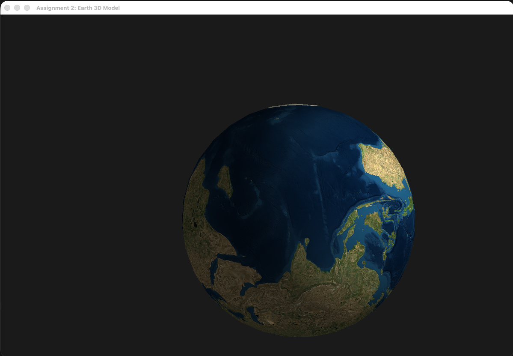

# Assignment 2: Earth 3D Model

## Overview

A 3D Earth model viewer built with OpenGL, featuring photorealistic textures and interactive camera controls. The application displays a textured Earth sphere with proper lighting and rotation animation.

## Features

### 🌍 Earth Model
- **Photorealistic Textures**: High-quality Earth surface textures (2K resolution)
- **Realistic Lighting**: Phong shading with ambient, diffuse, and specular lighting
- **Smooth Animation**: Continuous rotation with configurable speed
- **High-Quality Sphere**: Procedurally generated sphere with proper UV mapping

### 🎮 Interactive Controls
- **WASD**: Move camera around the Earth
- **Mouse**: Look around the scene
- **SPACE**: Toggle rotation on/off
- **TAB**: Toggle wireframe mode
- **Q/E**: Adjust lighting intensity
- **ESC**: Exit application

### ⚙️ Technical Features
- OpenGL 3.3 Core Profile rendering
- Custom vertex and fragment shaders
- Texture loading with stb_image
- Procedural sphere generation
- Equirectangular UV mapping

## Screenshots


*3D Earth model with photorealistic textures and lighting*

## Video Demonstration

### 🎥 Assignment Submission Video
**File**: `video/earth_demo.mov`

[🎬 Watch Demo Video](video/earth_demo.mov)
*Click to view the Earth 3D model demonstration*

### Video Content
This demonstration video showcases:
- **Photorealistic Earth model** with high-quality textures
- **Smooth rotation animation** with configurable speed
- **Interactive camera controls** using mouse and keyboard
- **Realistic lighting** with Phong shading
- **Wireframe mode** toggle for technical viewing

## Technical Implementation

### Architecture
- **Language**: C++17
- **Graphics API**: OpenGL 3.3 Core Profile
- **Window Management**: GLFW
- **Mathematics**: GLM (OpenGL Mathematics)
- **Build System**: CMake
- **Texture Loading**: stb_image

### Code Structure
```
main.cpp                 # Main application logic and rendering loop
resources/
├── vs/
│   └── kinetic_sculpture.vs    # Vertex shader
├── fs/
│   └── kinetic_sculpture.fs    # Fragment shader
├── 23-earth_photorealistic_2k/
│   ├── Earth 2K.obj            # Earth model (not used)
│   ├── Textures/
│   │   ├── Diffuse_2K.png      # Earth surface texture
│   │   ├── Clouds_2K.png       # Clouds texture
│   │   └── Night_lights_2K.png # Night lights texture
│   └── Supporting_files/
│       └── README.pdf          # Model documentation
└── stb_image.h                 # Image loading library
CMakeLists.txt          # Build configuration
README.md              # This file
```

## Building and Running

### Prerequisites
- C++17 compatible compiler (GCC, Clang, or MSVC)
- CMake 3.16 or higher
- OpenGL 3.3+ support
- GLFW3 library
- GLM library

### Build Instructions

1. **Build the project**:
   ```bash
   ./build.sh
   ```

2. **Run the executable**:
   ```bash
   cd build/Assignment_2:3D_kinetic_sculpture_animation
   ./Assignment_2_3D_kinetic_sculpture_animation
   ```

## Usage Instructions

1. **Launch the application** - The Earth will start rotating automatically
2. **Explore the Earth** - Use mouse to look around and WASD to move camera
3. **Toggle rotation** - Press SPACE to start/stop Earth rotation
4. **Wireframe mode** - Press TAB to see wireframe view
5. **Adjust lighting** - Use Q/E keys to increase/decrease light intensity
6. **Exit** - Press ESC to close the application

## Credits

### Libraries
- **OpenGL**: Graphics API
- **GLFW**: Window management
- **GLM**: Mathematics library
- **stb_image**: Image loading

### Textures
- **Earth Textures**: 23-earth_photorealistic_2k model pack
  - Diffuse_2K.png: Earth surface
  - Clouds_2K.png: Cloud layer
  - Night_lights_2K.png: Night lights

---

*Assignment 2: Earth 3D Model*  
*Computer Graphics and Game Development*
